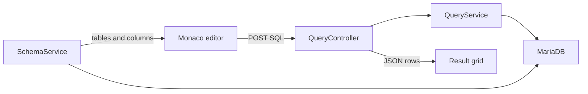

# MariaDB query IDE

Build the first working IDE in [src/MariaStudio.WebApp](src/MariaStudio.WebApp): one MariaDB connection from configuration, a Monaco editor, execute, a result grid, a table list, and schema completions. MariaDB is reached only from the server.

## Backend

Add NuGet package `MySqlConnector` (2.6.2) to [MariaStudio.WebApp.csproj](src/MariaStudio.WebApp/MariaStudio.WebApp.csproj).

In [Program.cs](src/MariaStudio.WebApp/Program.cs), read `ConnectionStrings:MariaDb`, force `AllowLoadLocalInfile=false` and `AllowUserVariables=true` through `MySqlConnectionStringBuilder`, then `AddMySqlDataSource`. Register `QueryService` and `SchemaService`.

Put a placeholder connection string in [appsettings.Development.json](src/MariaStudio.WebApp/appsettings.Development.json) pointing at `127.0.0.1:3306`. The real password stays in user secrets (`dotnet user-secrets set "ConnectionStrings:MariaDb" "..."`), which override that file. Do not commit a password.

Add:

- [Models/QueryModels.cs](src/MariaStudio.WebApp/Models/QueryModels.cs) — `QueryRequest`, `QueryResponse`, `ResultSetDto`, `SchemaNode`, `CompletionItemDto`.
- [Services/QueryService.cs](src/MariaStudio.WebApp/Services/QueryService.cs) — open a connection from `MySqlDataSource`, run the posted SQL with `CommandTimeout` of 30 seconds, walk every result set, stop each set at 500 rows, and return elapsed time plus a MariaDB error message instead of an unhandled exception.
- [Services/SchemaService.cs](src/MariaStudio.WebApp/Services/SchemaService.cs) — parameterized reads of `information_schema.TABLES` and `information_schema.COLUMNS` for the current database.
- [Controllers/QueryController.cs](src/MariaStudio.WebApp/Controllers/QueryController.cs) — `Index`, `POST Execute` with `[ValidateAntiForgeryToken]`, `GET Tree`, `GET Complete`. Pass the request `CancellationToken` into both services.

Change the default route in [Program.cs](src/MariaStudio.WebApp/Program.cs) to `Query/Index` so the app opens on the IDE. Keep `Home/Error`.

## Editor and page

Install `monaco-editor` 0.56.0 and copy `node_modules/monaco-editor/min` to [wwwroot/lib/monaco-editor/min](src/MariaStudio.WebApp/wwwroot/lib/monaco-editor/min). `node_modules/` is already gitignored. The page loads the local AMD build (`min/vs/loader.js`), language `sql`, dark theme, Ctrl+Enter to run.

Add a full-height [Views/Shared/_StudioLayout.cshtml](src/MariaStudio.WebApp/Views/Shared/_StudioLayout.cshtml) so the IDE is not wrapped in the Bootstrap `.container` from [_Layout.cshtml](src/MariaStudio.WebApp/Views/Shared/_Layout.cshtml).

Add:

- [Views/Query/Index.cshtml](src/MariaStudio.WebApp/Views/Query/Index.cshtml) — schema pane, Run button, editor host, results host, antiforgery token.
- [wwwroot/js/query-editor.js](src/MariaStudio.WebApp/wwwroot/js/query-editor.js) — create Monaco, post `{ sql }` to `/Query/Execute` with the `RequestVerificationToken` header, paint cells with `textContent`, load `/Query/Tree`, and register a completion provider that calls `/Query/Complete`.
- [wwwroot/css/studio.css](src/MariaStudio.WebApp/wwwroot/css/studio.css) — two-column layout: 240px schema tree, editor, and a 240px results pane.

Clicking a table name inserts it at the caret.

## Verify

Run the app and, in the browser, confirm the editor loads, Ctrl+Enter or Run sends SQL, a `SELECT` shows columns and rows, a bad statement shows the MariaDB error in the status line, and the schema list plus completion requests succeed. This needs a reachable MariaDB and the user-secrets connection string. If the server is down, the editor should still load and Execute should show the connection error.